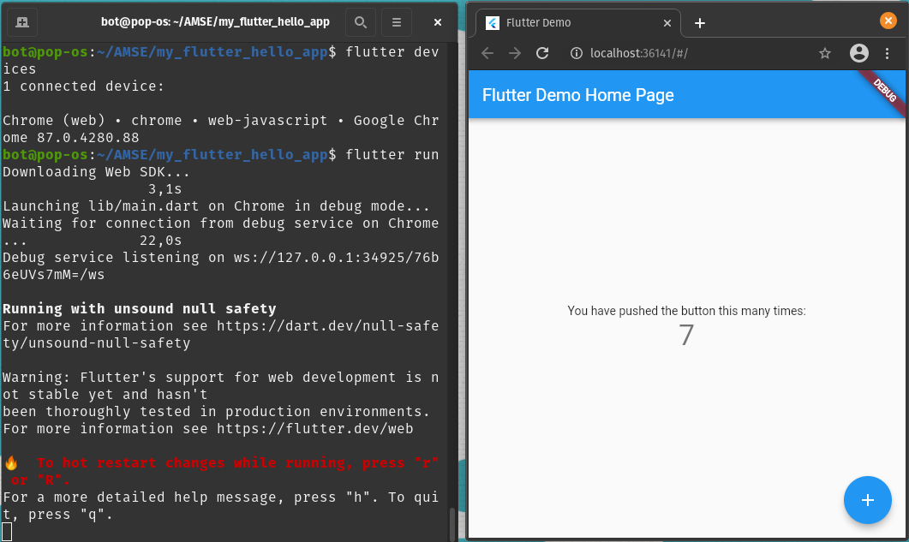
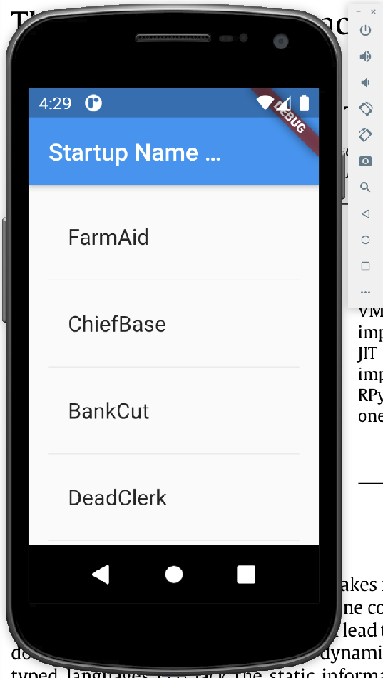

## Outils

- [Visual studio code](https://code.visualstudio.com/)
    - plugin : [Flutter](https://marketplace.visualstudio.com/items?itemName=Dart-Code.flutter)

## Installer git

Installer :

- [Git for Windows](https://gitforwindows.org/)
- Client git : [TurtoiseGit pour windows](https://tortoisegit.org/) ou [SourceTree](https://www.sourcetreeapp.com/)

Créer ensuite votre dépôt git pour AMSE sur Github. Vous devez avoir une URL de dépôt similaire à : https://github.com/votre_login/amse.git

## Installer Flutter

Attention les instructions ci-dessous peuvent fonctionner sur tous les systèmes mais supposent que vous savez régler des variables d'environnement, ....


Toutes les instructions d'installation ci-après donnent les commandes SHELL pour installer Flutter.
Si vous êtes sous Windows, il faudra adapter ces instructions.


Si vous voulez utiliser la dernière version du dépôt git de Flutter et installer manuellement Flutter :

```
$ git clone https://github.com/flutter/flutter.git
$ ls flutter
analysis_options.yaml  CODE_OF_CONDUCT.md  dartdoc_options.yaml  flutter_console.bat  PATENT_GRANT
AUTHORS                CODEOWNERS          dev/                  LICENSE              README.md
bin/                   CONTRIBUTING.md     examples/             packages/            version
```


Configurer la variable d'environnement `PATH` en ajoutant le chemin `flutter.git/bin`.
*Sous GNU/Linux*, à la fin de votre `.bashrc` ou `.profile`:

```
# Flutter & Dart
export PATH="$PATH:$HOME/flutter/bin"
export CHROME_EXECUTABLE="/usr/bin/chromium" # inutile si google-chrome

```

*Sous Windows*, régler votre variable d'environnment `PATH` via les préférences Windows.
<!-- - https://flutter.dev/docs/get-started/install -->
<!-- -  MLS/Ressources sur Flutter/Module Mobile et Image - Annexes - V0.1.pdf -->


Vous devez maintenant avoir accès à l'outil CLI (Command Line Interface) `flutter` qui permet de créer un projet, de le compiler et de l'exécuter.

```
$ flutter help
...

$ flutter doctor
[✓] Flutter (Channel master, 1.26.0-2.0.pre.313, on Linux, locale fr_FR.UTF-8)
[✗] Android toolchain - develop for Android devices
    ✗ Unable to locate Android SDK.
      Install Android Studio from: https://developer.android.com/studio/index.html
      On first launch it will assist you in installing the Android SDK components.
      (or visit https://flutter.dev/docs/get-started/install/linux#android-setup for detailed instructions).
      If the Android SDK has been installed to a custom location, please use
      `flutter config --android-sdk` to update to that location.

[✓] Chrome - develop for the web
[!] Android Studio (not installed)
[✓] VS Code (version 1.49.2)
[✓] Connected device (1 available)

! Doctor found issues in 2 categories.
```

La commande `flutter doctor` permet de vérifier que votre installation est correcte.
Attention, nous n'avons pas encore tout installé et il est normal d'avoir des éléments en rouge à ce stade (Android SDK et Android studio par exemple) mais nous pouvons déjà créer un projet Flutter.

## Créer un projet Flutter

```
$ flutter create my_flutter_hello_app
$ cd my_flutter_hello_app
$ ls
android  integration_test  ios  lib  my_flutter_hello_app.iml  pubspec.lock  pubspec.yaml  README.md  test  web
```

## Exécuter un projet Flutter dans Chrome

Docs : [https://flutter.dev/docs/get-started/web]() [https://flutter.dev/web]()

```
$ flutter devices
1 connected device:

Chrome (web) • chrome • web-javascript • Google Chrome 87.0.4280.88

$ flutter run
...
```

Vous devez voir l'application apparaitre dans le navigateur Chrome.




## [Facultatif] Exécuter un projet Flutter sur un Smartphone connecté en USB

- Installer [Androïd Studio](https://flutter.dev/docs/get-started/install/linux#android-setup)
- Configurer votre smartphone Android en mode développeur ([instructions d'installation](https://flutter-examples.com/run-test-flutter-apps-directly-on-real-android-device/)) et activer les options de développement dont "USB Debugging"
- Brancher votre smartphone sur votre pc via l'USB. Si vous utilisez une VM Virtualbox, il faut attacher le smartphone à la VM (icône USB en bas à droite de la fenêtre de la VM)
- Taper les commandes :

```
$ flutter doctor
flutter doctor
Doctor summary (to see all details, run flutter doctor -v):
[✓] Flutter (Channel stable, 1.22.5, on Linux, locale en_US.UTF-8)
[✓] Android toolchain - develop for Android devices (Android SDK version 30.0.2)
[✓] Android Studio (version 4.0)
[✓] VS Code (version 1.52.1)
[✓] Connected device (1 available)

• No issues found!

$ flutter devices
1 connected device:

SM G973F (mobile) • RF8M91RQ91B • android-arm64 • Android 9 (API 28)

$ flutter run
 flutter run
Running "flutter pub get" in MyFlutterHelloWorld...                906ms
Launching lib/main.dart on SM G973F in debug mode...
Running Gradle task 'assembleDebug'...
Running Gradle task 'assembleDebug'... Done                        24.9s
✓ Built build/app/outputs/flutter-apk/app-debug.apk.
Installing build/app/outputs/flutter-apk/app.apk...                 9.1s
Activating Dart DevTools...                                         4.5s
Syncing files to device SM G973F...                                 80ms

Flutter run key commands.
r Hot reload. 🔥🔥🔥
R Hot restart.
h Repeat this help message.
d Detach (terminate "flutter run" but leave application running).
c Clear the screen
q Quit (terminate the application on the device).
An Observatory debugger and profiler on SM G973F is available at:
http://127.0.0.1:45123/PTlzUu8LUHw=/

Flutter DevTools, a Flutter debugger and profiler, on SM G973F is available at:
http://127.0.0.1:9100?uri=http%3A%2F%2F127.0.0.1%3A45123%2FPTlzUu8LUHw%3D%2F

Running with unsound null safety
For more information see https://dart.dev/null-safety/unsound-null-safety

```

L'application devrait apparaitre sur votre smartphone connecté en USB.

## [Facultatif] Exécuter un projet Flutter dans un simulateur

Il faut d'abord configurer un émulateur dans Androïd Studio (cf. Documentation [Flutter + Android SDK || iOS SDK](https://flutter.dev/docs/get-started/install)).
Pour cela, ouvrez le projet `MyFlutterHelloWorld` dans Android Studio et ajoutez-en un dans le menu `Open Tools>AVD Manager`. Si vous êtes sur mac, vous pouvez utiliser Xcode et un émulateur d'iPhone.
Ensuite :

```
$ flutter emulators
2 available emulators:
Pixel_2_API_28      • Pixel 2 API 28      • Google • android
Pixel_3a_API_30_x86 • Pixel_3a_API_30_x86 • Google • android

# select default emultators
$ flutter emulators --launch Pixel_2_API_28

# cd app + run the app
$ flutter run
...
```

L'application devrait apparaitre dans un simulateur.


