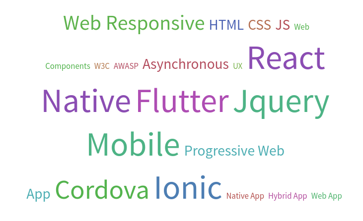

# Développement d'applications mobiles hybrides

Dans ce cours, vous allez découvrir comment développer des applications mobiles à l'aide du framework [Flutter](https://flutter.dev/) basé sur les technologies Web et le langage [Dart](https://dart.dev/).

Il existe 3 grands familles d'approches pour développer des applications mobiles :

- Application Native (iOS, Android SDKs)
- Application Web (Web Responsive)
- Application Hybride (Native+Web)

Les applications natives sont généralement rapides et bien optimisées pour la plateforme pour laquelle elles ont été développées. Par contre, il faudra re-développer l'application à partir de zéro pour chaque plateforme (iOS, Androïd, ... ) en utilisant les outils de développement spécifiques à cette plateforme (SDK, ...).

Les applications Web sont portables sur toutes les plateformes et ne nécessitent qu'un seul développement. Toutefois, elles sont généralement moins efficaces qu'une application native et limitées par le navigateur Web dans lequel elles s'exécutent. Il est ainsi difficile voire impossible d'accéder aux capteurs du terminal mobile (appareil photo, ...).

Les applications hybrides combinent le meilleur des deux approches précédentes. Ci-dessous 3 technologies hybrides.

[Ionic](https://ionicframework.com/) propose de développer son application en utilisant Javascript. L'application résultante s'exécutera dans un conteneur Web invisible. Ionic ne permet pas d'utiliser les Widgets natifs du terminal dans son application mais permet une excellente portabilité.

[React Native](https://reactnative.dev/) développé par Facebook permet de développer son application en scriptant les widget natifs de votre terminal iOS ou Androïd avec Javascript et `react.js`. Le même code permet donc de générer les applications pour les deux environnements.

[Flutter](https://flutter.dev/) issu de chez Google, propose d'utiliser le langage Dart pour développer votre application qui sera ensuite compilée soit vers iOS, soit vers Androïd. Flutter utilise ses propres widgets (Flutter UI components) qui imitent les widgets natifs et sont portables.

Dans ce cours, nous utiliserons Flutter qui offre une bonne portabilité, de bonnes perfomances (contrairement à Ionic) et la possibilité de modifier vos widgets au pixel près (contrairement à React Native).