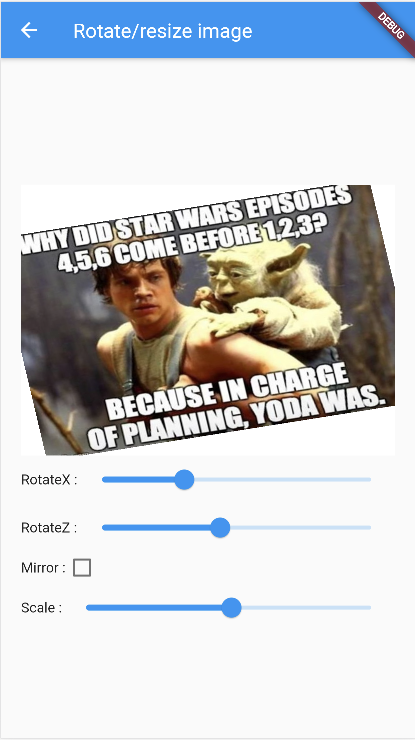
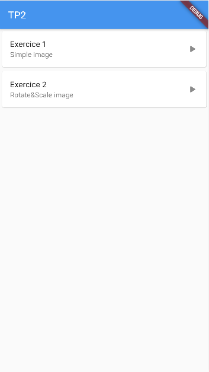

Ce TP2 a pour but de vous guider dans la réalisation un jeu de Taquin.
Avant cela, nous allons réaliser une série d'exercices pour en construire des parties.

## Exo 1 : afficher une image

Affichez une image à l'aide du Widget [Image](https://api.flutter.dev/flutter/widgets/Image-class.html)
    - vous pouvez utiliser une image aléatoire grâce à https://picsum.photos/512/1024
    - Remarquez que l'image d'adapte automatiquement à la taille de l'écran
    - Tester le passage en mode paysage

## Exo 2 : Transformer une image

Appliquez des rotations, des homotéthies ou encore un effet miroir à une image à l'aide des widgets : [Slider](https://api.flutter.dev/flutter/material/Slider-class.html), [Transform](https://api.flutter.dev/flutter/widgets/Transform-class.html).



Vous pouvez égalament *clipper* le rendu d'un widget dans un [Container](https://api.flutter.dev/flutter/widgets/Container-class.html) pour qu'il ne dépasse jamais de la zone conteneur.
Dans l'exemple ci-dessus, les coins de l'image sont coupés et peuvent pas dépasser le conteneur englobant. Exemple de code :

```dart
Container(
    clipBehavior: Clip.hardEdge,
    decoration: BoxDecoration(color: Colors.white),
    child: ...
)
```

## Exo 3 : Menu et navigation entre pages

Réaliser une page menu qui permet de naviguer entre les exercices.
Pour cela, vous pouvez utiliser les widgets : [ListView](https://api.flutter.dev/flutter/widgets/ListView-class.html), [Card](https://api.flutter.dev/flutter/material/Card-class.html) et
[ListTile](https://api.flutter.dev/flutter/material/ListTile-class.html).

Pour naviguer entre les pages, je vous recommende d'utiliser la propriété *onTap* de ListTile couplée avec le widget [Navigator](https://api.flutter.dev/flutter/dart-html/Navigator-class.html.
Un exemple simple de navigation est présenté ici : [Navigation entre pages](https://flutter.dev/docs/cookbook/navigation/passing-data).




## Exo 4 : Affichage d'un morceau d'image (une tuile)

`TODO`

## Exo 5 : Animation d'une tuile

`TODO`

## Exo 6 : Génération du plateau de tuiles

`TODO`


## Jeu de taquin

En utilisant ou vous inspirant de tout ce qui a été vu depuis le début de ce tp, vous devez réaliser un jeu de taquin complet.
Certaines fonctionnalités sont imposées mais vous pouvez ajouter tout ce qui vous amuse.

Votre jeu aura au minimum 3 pages (vous pouvez en ajouter d'autres) :
- une page de configuration
- une page pour jouer
- une page infos (auteurs, ...)

La page de configuration doit permettre :
- de régler la taille du taquin c'est-à-dire le nombre de lignes et de colonnes
- de choisir la difficulté i.e. le nombre de déplacements réalisés pour mélanger. Attention, il faut garantir la possibilité de pouvoir reconstituer l'image. Pour cela, il suffit de mélanger en réalisant des déplacements valides des tuiles
- de choisir une image :
    * depuis internet via https://picsum.photos/512 par exemple
    * (facultatif) à partir d'une image parmi les photos de l'appareil ou de prendre une photo
    (cf. https://pub.dev/packages/image_picker par exemple - non testé)

La page de jeu doit permettre :
- d'afficher le plateau de jeu constitué de tuiles i.e. les morceaux de l'image mélangés
- de jouer, c'est-à-dire que le joueur peut déplacer une tuile adjacente à la case vide,
- d'afficher un compteur de déplacements
- d'indiquer au joueur lorsqu'il a gagné
- d'annuler le dernier coup joué (variante : autant de coups que l'on souhaite),
- (difficile) : d'afficher un compteur indiquant en combien de coups il est possible de gagner à partir de la position courante
