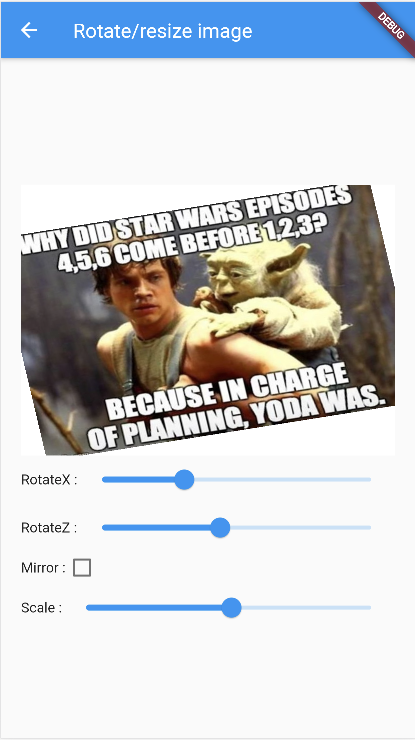
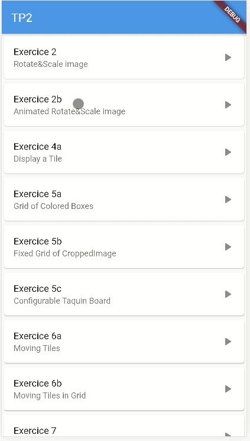
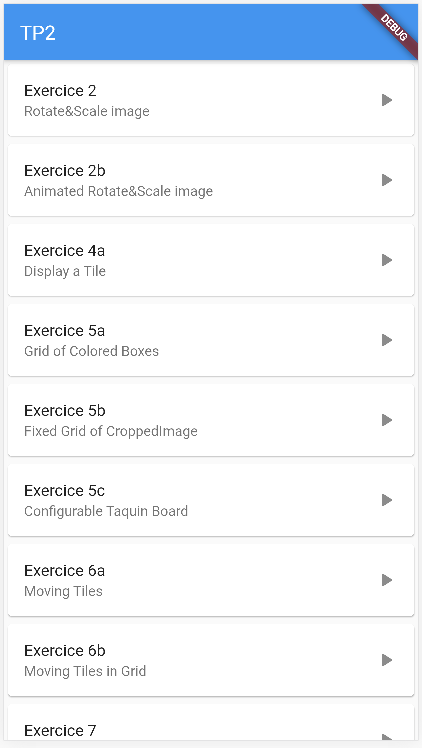
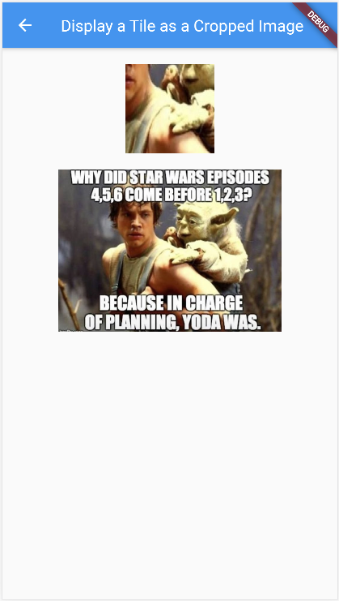
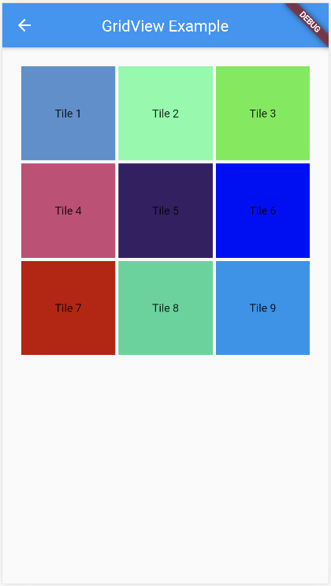
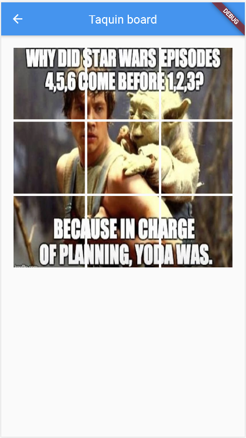
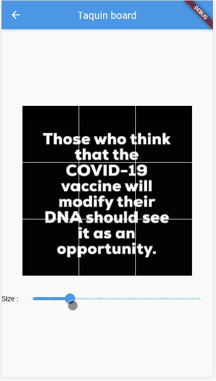
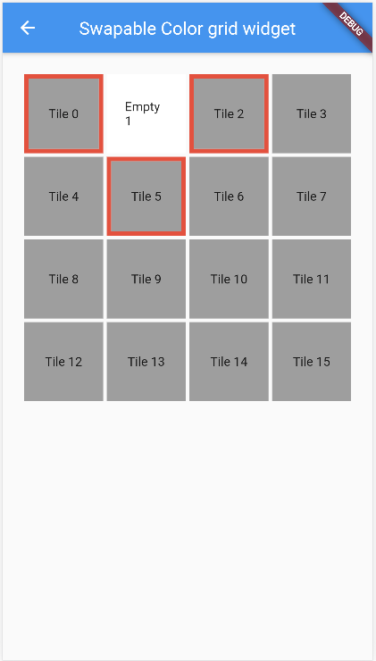
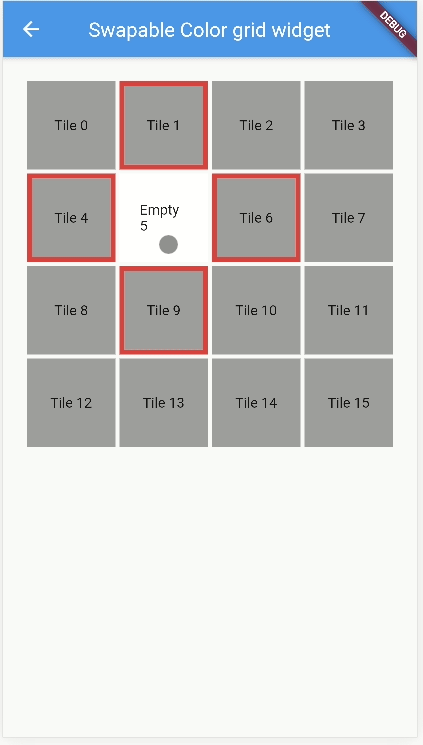
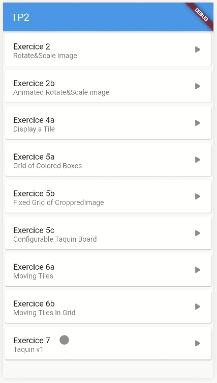

Ce TP2 a pour but de vous guider dans la réalisation un jeu de Taquin.
Avant cela, nous allons réaliser une série d'exercices pour en construire des parties.

## Exo 1 : afficher une image

Affichez une image à l'aide du Widget [Image](https://api.flutter.dev/flutter/widgets/Image-class.html)
    - vous pouvez utiliser une image aléatoire grâce à https://picsum.photos/512/1024
    - Remarquez que l'image d'adapte automatiquement à la taille de l'écran
    - Tester le passage en mode paysage

## Exo 2 : Transformer une image

Appliquez des rotations, des homotéthies ou encore un effet miroir à une image à l'aide des widgets : [Slider](https://api.flutter.dev/flutter/material/Slider-class.html), [Transform](https://api.flutter.dev/flutter/widgets/Transform-class.html).



Vous pouvez égalament *clipper* le rendu d'un widget dans un [Container](https://api.flutter.dev/flutter/widgets/Container-class.html) pour qu'il ne dépasse jamais de la zone du conteneur.
Dans l'exemple ci-dessus, les coins de l'image sont coupés et ne peuvent pas dépasser le conteneur englobant. Exemple de code :

```Dart
Container(
    clipBehavior: Clip.hardEdge,
    decoration: BoxDecoration(color: Colors.white),
    child: ...
)
```

Vous pouvez même essayer d'automatiser l'incrémentation des valeurs pour produire une animation. Pour cela, vous pouvez utiliser :

```dart
    ...
    const d = const Duration(milliseconds: 50);
    new Timer.periodic(d, animate);
    // this new Timer automatically calls animate every 50ms
    ...

void animate(Timer t) {
    ...
    t.cancel(); // stops the timer
}
```



## Exo 3 : Menu et navigation entre pages

Réaliser une page menu qui permet de naviguer entre les exercices.
Pour cela, vous pouvez utiliser les widgets : [ListView](https://api.flutter.dev/flutter/widgets/ListView-class.html), [Card](https://api.flutter.dev/flutter/material/Card-class.html) et
[ListTile](https://api.flutter.dev/flutter/material/ListTile-class.html).

Pour naviguer entre les pages, je vous recommende d'utiliser la propriété *onTap* de ListTile couplée avec le widget [Navigator](https://api.flutter.dev/flutter/dart-html/Navigator-class.html.
Un exemple simple de navigation est présenté ici : [Navigation entre pages](https://flutter.dev/docs/cookbook/navigation/passing-data).




## Exo 4 : Affichage d'une tuile (un morceau d'image)

Ci-dessous le code complet de la widget `DisplayTileWidget` permettant d'afficher une partie d'image (*cropped*). L'idée est d'utiliser :
- [SizedBox](https://api.flutter.dev/flutter/widgets/SizedBox-class.html) qui spécifie la taille de notre tuile
- contenant une [ClipRect](https://api.flutter.dev/flutter/widgets/ClipRect-class.html) qui permet couper une image
- contenant une [Align](https://api.flutter.dev/flutter/widgets/Align-class.html) qui permet de positionner la ClipRect par rapport à l'[Image](https://api.flutter.dev/flutter/widgets/Image-class.html) qu'elle contient. Les paramètres `widthFactor` et `heightFactor` permettent de contrôler comment l'image originale est morcellée et la portion qui sera affichée.



```dart
import 'package:Taquin/util.dart';
import 'package:flutter/material.dart';

class Tile {
  String imageURL;
  Alignment alignment;

  Tile({this.imageURL, this.alignment});

  Widget croppedImageTile() {
    return FittedBox(
      fit: BoxFit.fill,
      child: ClipRect(
        child: Container(
          child: Align(
            alignment: this.alignment,
            widthFactor: 0.3,
            heightFactor: 0.3,
            child: Image.network(this.imageURL),
          ),
        ),
      ),
    );
  }
}

Tile tile = new Tile(
    imageURL: ImageGenerator.getStaticImageURL(0), alignment: Alignment(0, 0));

class DisplayTileWidget extends StatelessWidget {
  @override
  Widget build(BuildContext context) {
    return Scaffold(
      appBar: AppBar(
        title: Text('Display a Tile as a Cropped Image'),
        centerTitle: true,
      ),
      body: Center(
          child: Column(children: [
        SizedBox(
            width: 150.0,
            height: 150.0,
            child: Container(
                margin: EdgeInsets.all(20.0),
                child: this.createTileWidgetFrom(tile))),
        Container(
            height: 200,
            child: Image.network(ImageGenerator.getStaticImageURL(0),
                fit: BoxFit.cover))
      ])),
    );
  }

  Widget createTileWidgetFrom(Tile tile) {
    return InkWell(
      child: tile.croppedImageTile(),
      onTap: () {
        print("tapped on tile");
      },
    );
  }
}
```


## Exo 5 : Génération du plateau de tuiles

Vous pouvez maintenant essayer de générer un plateau de tuiles en utilisant une [GridView](https://api.flutter.dev/flutter/widgets/GridView-class.html). Commencez par une version de taille fixe où les cases sont de simples [Container](https://api.flutter.dev/flutter/widgets/Container-class.html).



Puis faite une version où les cases sont des portions d'une même image.



Enfin, permettez à l'utilisateur de configurer la taille en supposant que le plateau est carré (nombre de tuiles en largeur et en hauteur identique).




## Exo 6 : Animation d'une tuile

Le code ci-dessous permet d'échanger deux tuiles comme sur la figure.
Testez et analysez ce code.


```
import 'package:flutter/material.dart';
import 'dart:math' as math;

// ==============
// Models
// ==============

math.Random random = new math.Random();

class Tile {
  Color color;

  Tile(this.color);
  Tile.randomColor() {
    this.color = Color.fromARGB(
        255, random.nextInt(255), random.nextInt(255), random.nextInt(255));
  }
}

// ==============
// Widgets
// ==============

class TileWidget extends StatelessWidget {
  final Tile tile;

  TileWidget(this.tile);

  @override
  Widget build(BuildContext context) {
    return this.coloredBox();
  }

  Widget coloredBox() {
    return Container(
        color: tile.color,
        child: Padding(
          padding: EdgeInsets.all(70.0),
        ));
  }
}

void main() => runApp(new MaterialApp(home: PositionedTiles()));

class PositionedTiles extends StatefulWidget {
  @override
  State<StatefulWidget> createState() => PositionedTilesState();
}

class PositionedTilesState extends State<PositionedTiles> {
  List<Widget> tiles =
      List<Widget>.generate(2, (index) => TileWidget(Tile.randomColor()));

  @override
  Widget build(BuildContext context) {
    return Scaffold(
      appBar: AppBar(
        title: Text('Moving Tiles'),
        centerTitle: true,
      ),
      body: Row(children: tiles),
      floatingActionButton: FloatingActionButton(
          child: Icon(Icons.sentiment_very_satisfied), onPressed: swapTiles),
    );
  }

  swapTiles() {
    setState(() {
      tiles.insert(1, tiles.removeAt(0));
    });
  }
}
```

Il faut noter :
- on a séparé les objets modèles (`Tile`) des objets vues (`Widgets`)
- `TileWidget` est une widget stateless
- `PositionedTiles` est widget stateful dont l'apparence doit changer lorsque l'ordre des tuiles change

Construisez une version améliorée permettant d'échanger deux tuiles dans un plateau.



Vous pouvez complexifier en ajoutant la possibilité de modifier la taille du plateau.



## Exo 7 : Jeu de taquin



En utilisant ou vous inspirant de tout ce qui a été vu depuis le début de ce TP, vous devez réaliser un jeu de taquin.
Ci-dessous des exemples de fonctionnalités.

Votre jeu peut permettre :
- de régler la taille du taquin c'est-à-dire le nombre de lignes et/ou le nombre de colonnes
- de choisir la difficulté i.e. le nombre de déplacements réalisés pour mélanger. Attention, il faut garantir la possibilité de pouvoir reconstituer l'image. Pour cela, il suffit de mélanger en ne réalisant que des déplacements valides de tuiles
- de choisir une image :
    * parmis quelques images statiques stockées dans votre projet (cf. [assets](https://flutter.dev/docs/development/ui/assets-and-images))
    * depuis internet via https://picsum.photos/512 par exemple
    * (facultatif) à partir d'une image parmi les photos de l'appareil ou de prendre une photo
    (cf. https://pub.dev/packages/image_picker par exemple - non testé)
- d'afficher le plateau de jeu constitué de tuiles i.e. les morceaux d'image mélangés
- de jouer, c'est-à-dire que le joueur peut déplacer une tuile adjacente à la case vide,
- d'afficher un compteur de déplacements
- d'indiquer au joueur lorsqu'il a gagné
- d'annuler le dernier coup joué (variante : autant de coups que l'on souhaite),
- (facultatif/difficile) : d'afficher un compteur indiquant en combien de coups il est possible de gagner à partir de la position courante

<h1>Soyez créatifs, amusez-vous, épatez-moi !</h1>